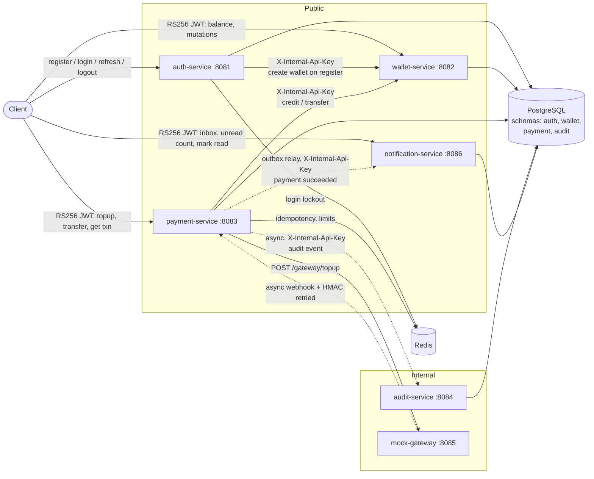
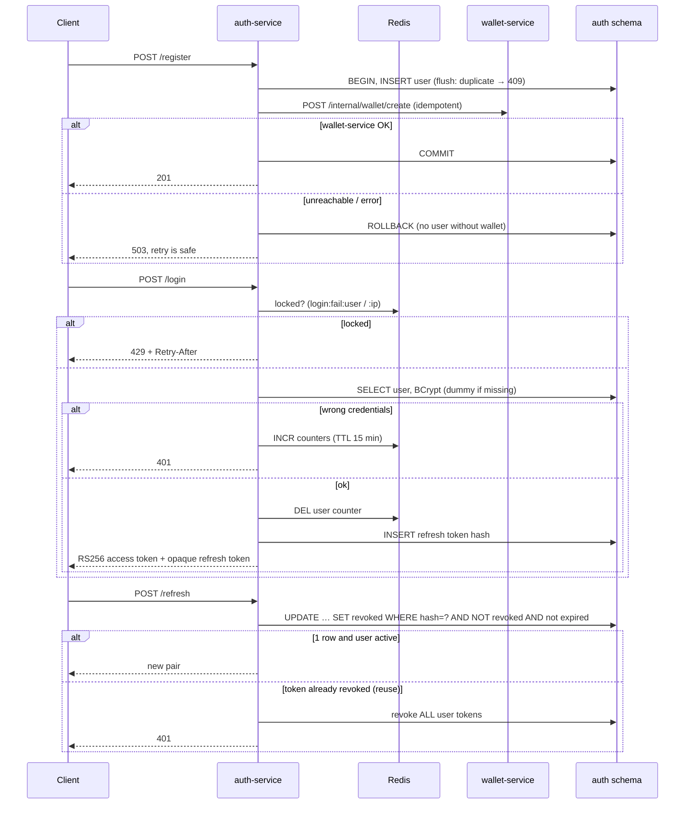
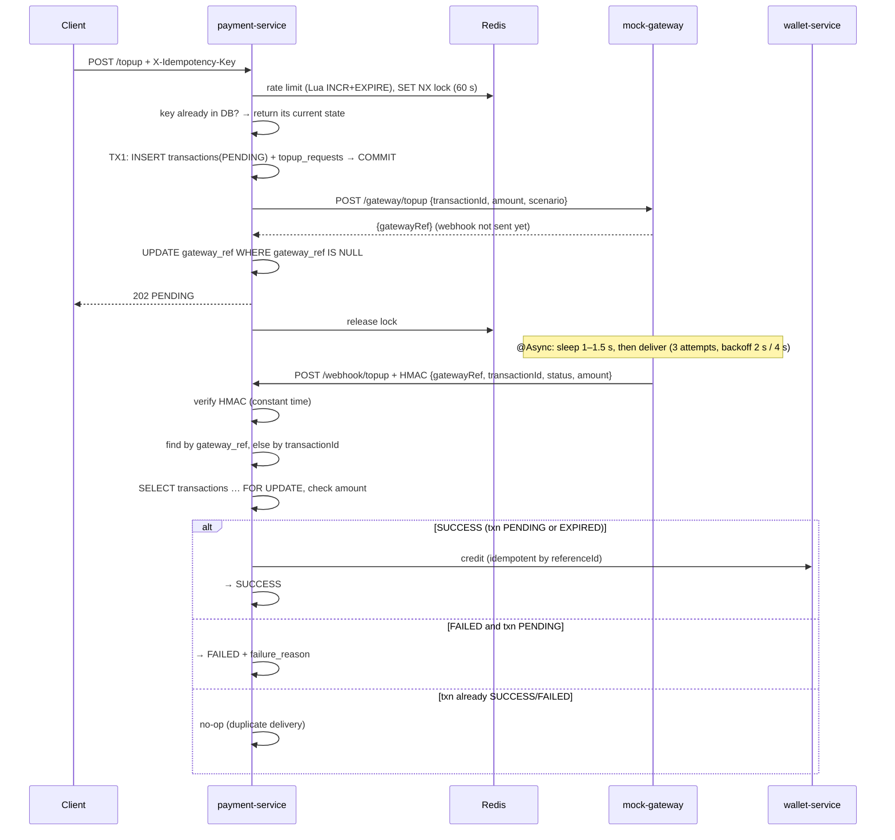
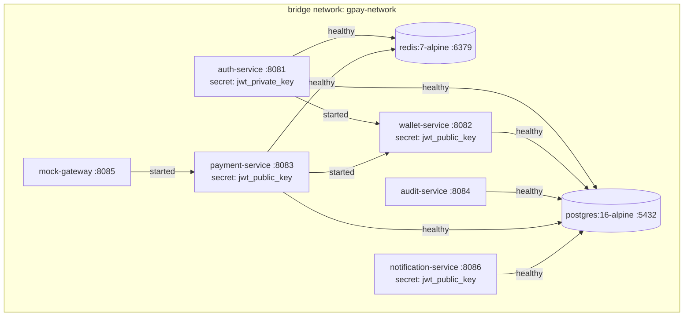

# Architecture — GPay Wallet

Microservices wallet system: register/login, top-up via a (mock) payment gateway, P2P transfer, balance and mutation history, audit logging.

> Source of truth: the code. Setup and upgrade steps are in [docs/getting-started.md](docs/getting-started.md), API usage in [docs/api-examples.md](docs/api-examples.md); schema details in [database.md](database.md). Remaining gaps are listed in [§9](#9-known-gaps).

---

## 1. Tech stack

| Layer | Choice |
|---|---|
| Language / runtime | Java 21 (Eclipse Temurin) |
| Framework | Spring Boot 3.5.14 (Web MVC, Data JPA, Security, Validation, Data Redis) |
| Build | Maven multi-module (`wallet-parent` → 6 independent modules, no cross-module dependencies) |
| Auth tokens | JJWT 0.12.5, **RS256** (private key in auth-service only) |
| Database | PostgreSQL 16 — one instance, one schema per service |
| Cache / locks | Redis 7 (payment-service: idempotency, limits; auth-service: login lockout) |
| Inter-service calls | Synchronous REST via `RestTemplate` with explicit timeouts |
| Async / jobs | Spring `@Async` (MDC-propagating executor), `@Scheduled` |
| Packaging | Multi-stage Dockerfile per service, `docker-compose.yaml` with file-based secrets |

---

## 2. Modules

```
monorepo-wallet/
├── pom.xml                       # parent POM: Boot parent, Java 21, jjwt versions
├── auth/                         # auth-service       :8081
├── wallets/                      # wallet-service     :8082
├── payment/                      # payment-service    :8083
├── auditlog/                     # audit-service      :8084
├── paymentgateway/               # mock-gateway       :8085
├── notification/                 # notification-service :8086
├── db/migration/                 # raw SQL, mounted into postgres initdb
├── scripts/generate-jwt-keys.sh  # RS256 key pair → keys/ (git- and docker-ignored)
└── docker-compose.yaml
```

Each service uses the same layered layout under `com.gpay.<module>`:

```
controller → service (interface) → service/Impl → repository (Spring Data JPA) → entity
client/     # outbound REST clients (wallet, audit, gateway)
dto/        # Java records grouped in one *DTO class, incl. ApiResponse<T>
exception/  # nested RuntimeException types + @RestControllerAdvice (incl. Spring MVC 4xx errors)
filter/     # TraceFilter (+ InternalApiKeyFilter where internal)
security/   # JwtAuthFilter + PemKeys (wallets, payment)
scheduler/  # background jobs (payment, auth)
config/     # SecurityConfig, RestConfig, AsyncConfig
```

All JSON responses use the envelope `{ "success": bool, "message": string, "data": T }`. Each service has its own `ApiResponse` copy; there is no shared library module.

---

## 3. System context



### Service responsibilities

| Service | Owns | Public API | Internal API | Calls out to |
|---|---|---|---|---|
| **auth** | `auth.users`, `auth.refresh_tokens`, Redis `login:fail:*` | `POST /api/v1/auth/{register,login,refresh,logout}` | — | wallets (create wallet) |
| **wallets** | `wallet.wallets`, `wallet.mutations` | `GET /api/v1/wallet/balance`, `GET /api/v1/wallet/mutations?page&size` | `POST /api/v1/internal/wallet/{create,credit,debit,transfer}` (all idempotent) | — |
| **payment** | `payment.transactions`, `payment.topup_requests`, `payment.transfer_requests`, `payment.outbox_events`, Redis `idempotency:*`, `rate:*`, `daily:*` | `POST /api/v1/topup`, `POST /api/v1/transfer`, `GET /api/v1/transactions/{id}` | `POST /api/v1/webhook/topup` (HMAC) | wallets, auditlog, gateway, notification |
| **notification** | `notification.notifications` | `GET /api/v1/notifications?page&size`, `GET /api/v1/notifications/unread-count`, `PATCH /api/v1/notifications/{id}/read`, `PATCH /api/v1/notifications/read-all` | `POST /api/v1/internal/notifications/events` (idempotent) | push provider (stub) |
| **auditlog** | `audit.audit_logs` | — | `POST /api/v1/internal/audit` | — |
| **paymentgateway** | stateless | — | `POST /gateway/topup` | payment (webhook) |

---

## 4. Security model

| Concern | Mechanism | Where |
|---|---|---|
| Access tokens | RS256 JWT (`iss`, `jti`, `sub`=userId, `username`, `type=ACCESS`), TTL `JWT_ACCESS_EXPIRY_MINUTES`. Signed with the private key, which only auth-service has | [JwtService.java](auth/src/main/java/com/gpay/auth/service/common/JwtService.java) |
| Token validation | wallets and payment verify with the **public key** and require `iss` + `type=ACCESS` (30 s clock skew). They cannot mint tokens; HS256/`none` tokens are rejected. Missing/invalid token → 401 | [wallets JwtAuthFilter](wallets/src/main/java/com/gpay/wallets/security/JwtAuthFilter.java), [payment JwtAuthFilter](payment/src/main/java/com/gpay/payment/security/JwtAuthFilter.java) |
| Key distribution | PEM files from `scripts/generate-jwt-keys.sh`, mounted as compose secrets at `/run/secrets/jwt_{private,public}_key`; loaded and validated at startup (fail fast) | `PemKeys` in each service |
| Refresh tokens | Opaque 256-bit random value, stored as SHA-256 hash. Rotated with an atomic conditional `UPDATE`; reuse of a rotated token revokes all sessions of the user; inactive users can't refresh; expired rows purged nightly | [AuthServiceImpl.java](auth/src/main/java/com/gpay/auth/service/Impl/AuthServiceImpl.java), [RefreshTokenCleanupJob.java](auth/src/main/java/com/gpay/auth/scheduler/RefreshTokenCleanupJob.java) |
| Brute force | Redis counters per username (5) and per client IP (20) in a 15-min window. When the limit is hit, login is rejected with 429 + `Retry-After` even with the correct password. Unknown usernames are counted too (no enumeration). Fails open if Redis is down | [LoginAttemptService.java](auth/src/main/java/com/gpay/auth/service/common/LoginAttemptService.java) |
| Login | Username/email lowercase-normalized; BCrypt always runs (dummy hash for unknown users); `is_active` revealed only after a correct password; >72-byte passwords rejected before BCrypt | `AuthServiceImpl.login` |
| Service-to-service | Shared `X-Internal-Api-Key`, compared in **constant time**; a blank key fails startup | `InternalApiKeyFilter` (wallets, auditlog) |
| Gateway → webhook | `X-Webhook-Signature = hex(HMAC-SHA256("gatewayRef:transactionId:status:amount", MOCK_GATEWAY_SECRET))`, verified in constant time; amount must equal the stored amount | [WebhookDispatcher.java](paymentgateway/src/main/java/com/gpay/paymentgateway/service/WebhookDispatcher.java), [WebhookServiceImpl.java](payment/src/main/java/com/gpay/payment/service/Impl/WebhookServiceImpl.java) |
| Ownership | `userId` always comes from the JWT `sub`. `GET /transactions/{id}` returns 404 for other users' transactions | payment controllers |
| Secrets hygiene | `.env` and `keys/` are git-ignored and excluded from Docker build contexts (`.dockerignore`) | repo root |

All services are stateless (`SessionCreationPolicy.STATELESS`, CSRF disabled).

---

## 5. Core flows

### 5.1 Register / login / refresh



### 5.2 Top-up (async gateway webhook)



Why this ordering works:
- The PENDING rows are committed **before** the gateway is called, so a webhook always finds the transaction.
- The gateway responds before it sends the webhook, because dispatch goes through a separate `@Async` bean.
- If the webhook still wins the race, payment-service falls back to looking up by `transactionId`.

Gateway scenarios: `SUCCESS`, `FAILED`, `TIMEOUT` (no webhook → expiry job → `EXPIRED`). A late `SUCCESS` webhook for an `EXPIRED` top-up still credits, because the gateway has taken the money.

### 5.3 Transfer (with persisted failures and reconciliation)

```mermaid
sequenceDiagram
    participant C as Client
    participant P as payment-service
    participant R as Redis
    participant W as wallet-service

    C->>P: POST /transfer + X-Idempotency-Key
    P->>R: rate limit, SET NX lock
    P->>P: key already in DB? → return its current state (422 if FAILED)
    P->>R: Lua: reserve amount against daily cap (atomic)
    P->>P: TX1: INSERT transactions(PENDING) + transfer_requests → COMMIT
    P->>W: POST /internal/wallet/transfer (referenceId = txnId; 1 retry on timeout/5xx)
    alt 200
        P->>P: PENDING → SUCCESS
        P-->>C: 200
    else 422 / 404 / other 4xx
        P->>P: PENDING → FAILED + reason, release daily reservation
        P-->>C: 422 with transaction
    else timeout / 5xx (outcome unknown)
        P-->>C: 202 PENDING
        Note over P: reconciler re-sends after 120 s; wallet dedupes by referenceId
    end
```

Status transitions use `UPDATE … WHERE status = 'PENDING'`, so the request thread, reconciler, webhook and expiry job can never overwrite each other's terminal status.

### 5.4 Success notifications (transactional outbox)

```mermaid
sequenceDiagram
    participant P as payment-service
    participant DB as payment schema
    participant N as notification-service
    participant C as Client app

    Note over P,DB: same DB transaction as the SUCCESS transition
    P->>DB: UPDATE transactions → SUCCESS (webhook TX / resolvePending CAS won)
    P->>DB: INSERT outbox_events(TOPUP_SUCCEEDED | TRANSFER_SUCCEEDED) ON CONFLICT DO NOTHING
    P->>DB: COMMIT

    loop every OUTBOX_POLL_INTERVAL_MS (2 s)
        P->>DB: SELECT due PENDING … FOR UPDATE SKIP LOCKED, lease 60 s, COMMIT
        P->>N: POST /internal/notifications/events {eventId, type, txnId, userId, counterpartyUserId, amount, IDR, occurredAt}
        N->>N: INSERT per recipient ON CONFLICT (transaction_id, type) DO NOTHING
        N-->>P: 200 {created}
        alt 200
            P->>DB: → PUBLISHED
        else timeout / 5xx / 401
            P->>DB: attempts+1, backoff 5 s · 2ⁿ (max 30 min); DEAD after OUTBOX_MAX_ATTEMPTS
        else 400 (payload rejected)
            P->>DB: → DEAD
        end
    end
    N-->>C: push after commit (async, best-effort)
    C->>N: GET /notifications, /unread-count
```

| Event | Recipient(s) | Notification (stored text) |
|---|---|---|
| `TOPUP_SUCCEEDED` | payer | `TOPUP_SUCCESS` · *Top up berhasil* · "Saldo Rp50.000 sudah masuk ke GPay kamu." |
| `TRANSFER_SUCCEEDED` | sender | `TRANSFER_SENT` · *Transfer berhasil* · "Kamu berhasil mengirim Rp10.000." |
| | recipient | `TRANSFER_RECEIVED` · *Dana masuk* · "Kamu menerima transfer Rp10.000." |

Guarantees:
- **No success without an event and no event without a success.** Both rows commit together. A transfer only records the event if *this* actor won the `PENDING → SUCCESS` compare-and-set, so the request thread and the reconciler never both emit it.
- **At-least-once delivery, exactly-once effect.** The relay can re-send (lease expiry, lost ack), but notification-service dedupes on `UNIQUE (transaction_id, type)` and still answers 200.
- **Payments never wait on notifications.** If notification-service is down, events queue in `outbox_events` and drain when it recovers.
- Only successes notify (as requested); failures and expiries are visible through `GET /transactions/{id}`.

---

## 6. Cross-cutting concerns

### Consistency & concurrency

| Problem | Solution | Location |
|---|---|---|
| Concurrent balance updates | `SELECT … FOR UPDATE` + `@Version` on wallets | [WalletRepository.java](wallets/src/main/java/com/gpay/wallets/repository/WalletRepository.java) |
| Transfer deadlocks | Lock wallets in ascending `userId` order | `WalletServiceImpl.atomicTransfer` |
| Duplicate client requests | DB `UNIQUE (user_id, idempotency_key)` is the source of truth for replays; a Redis SET NX lock (owner-token release) blocks concurrent duplicates; a lost insert race replays the winner | [IdempotencyServiceImpl.java](payment/src/main/java/com/gpay/payment/service/Impl/IdempotencyServiceImpl.java), `IdempotentReplay` |
| Same key, different request | 422 `Idempotency key was already used for a different request` | `IdempotentReplay` |
| Duplicate webhook / credit / transfer | Webhook row lock + terminal-state check; wallet-service checks `(wallet, reference_id, type)` under the row lock; DB `UNIQUE (wallet_id, reference_id, type)` | `WebhookServiceImpl`, `WalletServiceImpl` |
| Unknown transfer outcome | Stays `PENDING`; reconciler re-sends (idempotent) | `PendingTransactionScheduler.reconcilePendingTransfers` |
| Expiry vs webhook race | Expiry is a conditional bulk `UPDATE`; the webhook holds the row lock | `TransactionRepository.expirePendingTopups` |
| Daily cap under concurrency | Lua `INCRBY` + check + rollback in one script, integer cents | [RateLimitServiceImpl.java](payment/src/main/java/com/gpay/payment/service/Impl/RateLimitServiceImpl.java) |
| Ledger corruption | DB `CHECK`s: amount > 0, `balance_after = balance_before ± amount`, enum values | [V1__0710261200_hardening_constraints.sql](db/migration/V1__0710261200_hardening_constraints.sql) |
| User without wallet | Wallet created inside the registration TX; failure rolls back the user | `AuthServiceImpl.register` |

### Background jobs

| Service | Job | Trigger | Effect |
|---|---|---|---|
| payment | `expireStaleTopups` | every `PAYMENT_SCHEDULER_INTERVAL_MS` (60 s) | `PENDING` TOPUP older than `PENDING_EXPIRE_MINUTES` → `EXPIRED` + reason |
| payment | `reconcilePendingTransfers` | every 60 s | Re-sends `PENDING` TRANSFER older than `TRANSFER_RECONCILE_AFTER_SECONDS`, using the original `traceId` in logs |
| payment | `OutboxRelayScheduler.relay` | every `OUTBOX_POLL_INTERVAL_MS` (2 s) | Delivers due `outbox_events` to notification-service; `SKIP LOCKED` makes concurrent replicas safe |
| auth | `RefreshTokenCleanupJob` | `JWT_CLEANUP_CRON` (03:00) | Deletes expired refresh tokens (revoked-but-unexpired kept for reuse detection) |

Jobs run on a single instance. Running several payment-service replicas is still safe because every transition is conditional, but the work would be duplicated.

### Observability

- `TraceFilter` (every service) reads or creates `X-Trace-Id`, puts it into the MDC and echoes it back in the response.
- payment-service propagates `X-Trace-Id` to wallets, auditlog and gateway, and auth propagates it to wallets. The trace id is persisted on `payment.transactions` and `audit.audit_logs`.
- `@Async` work (audit) inherits the MDC through a `TaskDecorator`, so audit rows keep `trace_id`. Scheduled reconciliation restores the transaction's original `traceId`.
- Audit events: `TOPUP_INITIATED`, `TOPUP_WEBHOOK`, `TRANSFER`, `TRANSFER_RECONCILED`. Delivery is asynchronous and best-effort.

### Error mapping

| Case | HTTP |
|---|---|
| Validation, malformed JSON, missing header/param, bad idempotency key, self-transfer, bad webhook | 400 |
| Invalid credentials / token, bad webhook signature | 401 |
| Inactive account, wrong internal API key | 403 |
| Unknown path / transaction / notification | 404 |
| Duplicate username/email, idempotency key in flight | 409 |
| Transaction `FAILED`/`EXPIRED` (body includes the transaction), daily limit, key reused with a different request | 422 |
| Payment rate limit, login lockout | 429 + `Retry-After` |
| Wallet provisioning unavailable on register | 503 |
| Unhandled | 500 `"Internal server error"` |

Payment success codes: `200` SUCCESS, `202` PENDING.

---

## 7. Deployment



- Images: a `maven:3.9.9-eclipse-temurin-21-alpine` build stage (`mvn package -pl <module> -am`), then `eclipse-temurin:21-jre-alpine` running as non-root `appuser`.
- Build context is the repo root; `.dockerignore` keeps `.env`, `keys/`, `target/`, `.git/` out of it.
- JWT keys are compose file secrets. Key files must be world-readable (`644`) because compose bind-mounts them for the non-root user; use a real secret store in production.
- DB schema is created from `db/migration/` on an empty volume only. Existing volumes need the manual steps in [getting-started §5](docs/getting-started.md#5-upgrading-an-existing-environment).

### Configuration (env vars)

| Variable | Used by | Default |
|---|---|---|
| `DB_HOST`, `DB_PORT`, `DB_NAME`, `DB_USER`, `DB_PASSWORD` | compose → all DB services | — |
| `POSTGRES_HOST_PORT`, `REDIS_HOST_PORT` | compose (host side of the port mapping only) | 5432, 6379 |
| `REDIS_PASSWORD` | redis, auth, payment | — |
| `JWT_PRIVATE_KEY_PATH` | auth | `keys/jwt_private.pem` (compose: `/run/secrets/jwt_private_key`) |
| `JWT_PUBLIC_KEY_PATH` | wallets, payment, notification | `keys/jwt_public.pem` (compose: `/run/secrets/jwt_public_key`) |
| `JWT_ISSUER` | auth (sets), wallets + payment + notification (require) | `gpay-auth` |
| `JWT_ACCESS_EXPIRY_MINUTES`, `JWT_REFRESH_EXPIRY_DAYS` | auth | — |
| `JWT_CLEANUP_CRON` | auth | `0 0 3 * * *` |
| `LOGIN_MAX_ATTEMPTS_PER_USER`, `LOGIN_MAX_ATTEMPTS_PER_IP`, `LOGIN_LOCK_MINUTES` | auth | 5, 20, 15 |
| `INTERNAL_API_KEY` | auth, wallets, payment, auditlog, notification | — (blank fails startup) |
| `MOCK_GATEWAY_SECRET` | payment, gateway | — (blank fails startup) |
| `DAILY_TRANSFER_LIMIT` | payment | 10000000 |
| `PAYMENT_RATE_LIMIT_PER_MINUTE` | payment | 5 |
| `TOPUP_TIMEOUT_SECONDS` | payment (gateway read timeout) | 5 |
| `PENDING_EXPIRE_MINUTES` | payment | 60 |
| `PAYMENT_SCHEDULER_INTERVAL_MS` | payment | 60000 |
| `TRANSFER_RECONCILE_AFTER_SECONDS` | payment | 120 |
| `WALLET_SERVICE_URL` | auth, payment | `http://localhost:8082` |
| `AUDIT_SERVICE_URL`, `PAYMENT_GATEWAY_URL` | payment | `http://localhost:808x` |
| `PAYMENT_SERVICE_WEBHOOK_URL` | gateway | `http://payment-service:8083/api/v1/webhook/topup` |
| `NOTIFICATION_SERVICE_URL` | payment | `http://localhost:8086` |
| `OUTBOX_POLL_INTERVAL_MS`, `OUTBOX_BATCH_SIZE`, `OUTBOX_MAX_ATTEMPTS` | payment | 2000, 50, 10 |

### HTTP client timeouts

| Client | Connect | Read | Retries |
|---|---|---|---|
| auth → wallets (create wallet) | 2 s | 5 s | none (client retries register) |
| payment → wallets, auditlog | 3 s | 10 s | transfer: 1 retry on timeout/5xx |
| payment → gateway | 3 s | `TOPUP_TIMEOUT_SECONDS` | none (stays PENDING) |
| gateway → payment webhook | 3 s | 10 s | 3 attempts, 2 s / 4 s backoff |

---

## 8. Key design decisions & trade-offs

| Decision | Why | Trade-off |
|---|---|---|
| Schema-per-service in one Postgres | Data ownership boundaries, simple local ops | Shared instance/user = no hard isolation; single point of failure |
| RS256, private key only in auth | Resource services can't mint tokens; no secret shared with them | Key rotation = redeploy + re-login; no JWKS endpoint yet |
| Pessimistic locking on wallets | Correctness over throughput for money | Hot wallets serialize |
| No DB transaction across HTTP calls | Webhooks see committed state; DB pool not tied to downstream latency | Requires explicit compare-and-set transitions and a reconciler |
| Unknown outcome → PENDING + idempotent retry | Never record FAILED for money that may have moved | Transfers can complete minutes later |
| Money invariants as DB constraints | Code bugs can't corrupt the ledger | Migrations need care |
| Synchronous wallet provisioning in register | Every user has a wallet; no orphan users | Registration depends on wallet-service availability (503) |
| Redis login lockout per user + IP | Stops password guessing without DB writes | Known usernames can be locked by an attacker for 15 min |
| Best-effort async audit | Audit must not slow or break payments | Events lost if audit is down (no queue/outbox) |
| Notifications via transactional outbox + polling relay (no broker) | Atomic with the status change; reuses Postgres, no Kafka/RabbitMQ to operate | ~2 s latency; polling load on `outbox_events` (partial index keeps it cheap) |
| Notification text rendered at ingest and stored | Inbox matches the push; copy changes don't rewrite history | No per-user language yet (Bahasa Indonesia only) |

---

## 9. Known gaps

| Issue | Effect | Suggested fix |
|---|---|---|
| Single shared DB user for all schemas | Any service can read/write any schema | One role per schema; audit gets `INSERT` only |
| `TIMESTAMP` without time zone | Ambiguous if a container's TZ changes | `TIMESTAMPTZ` + `Instant`, migrated together with entities |
| No migration versioning (Flyway deliberately not used) | New SQL files must be applied by hand on existing volumes | Keep the manual steps in getting-started §5, or adopt a migration runner later |
| Gateway has no status-query API | A top-up whose webhooks all fail is expired even if the gateway charged; only a later webhook can fix it | Reconcile against a gateway status endpoint |
| Audit delivery is best-effort | Events lost if audit-service is down | Transactional outbox or message broker |
| Login lockout can be triggered by others | 15-min denial for a targeted username | CAPTCHA / progressive delays instead of a hard lock |
| Behind a reverse proxy, the client IP is the proxy's | Per-IP lockout becomes global | Enable `server.forward-headers-strategy` with a trusted proxy |
| Rate limit is a fixed 1-minute window | Bursts at window edges | Sliding window / token bucket |
| Push channel is a logging stub (`LoggingPushSender`) | No device push yet; inbox works | Device-token registry + FCM/APNs `PushSender` implementation |
| Notifications show no counterparty name | "Kamu menerima transfer Rp10.000" instead of "… dari Alice" | Carry sender/recipient display names in the event (payment has only user ids) |
| No retention for `notifications` / published `outbox_events` | Tables grow unbounded | Nightly purge (e.g. inbox 90 days, outbox 7 days) |
| Only unit tests for core logic (86, mocked I/O) + smoke test; no DB/Redis integration tests | JPA queries, Lua scripts, `ON CONFLICT`, `SKIP LOCKED` verified only end to end | Testcontainers integration tests (see [docs/testing.md §5](docs/testing.md#5-coverage-matrix)) |
