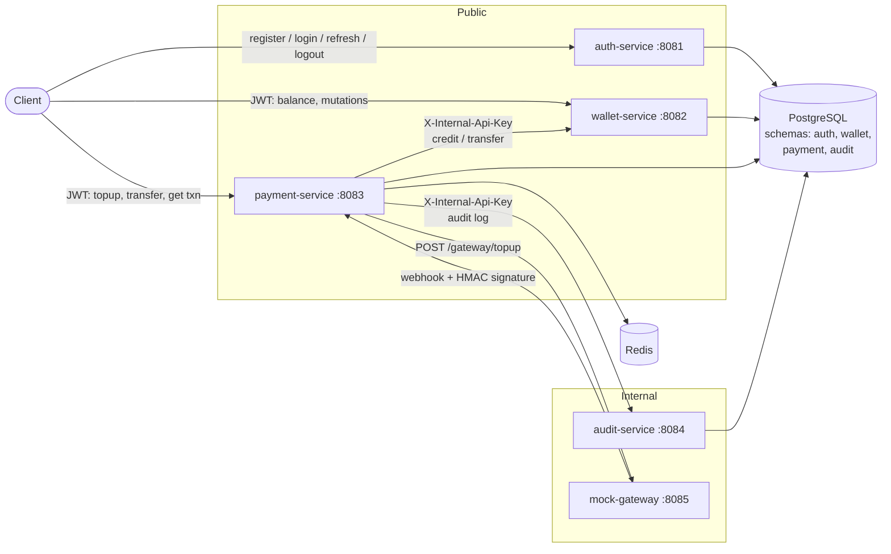
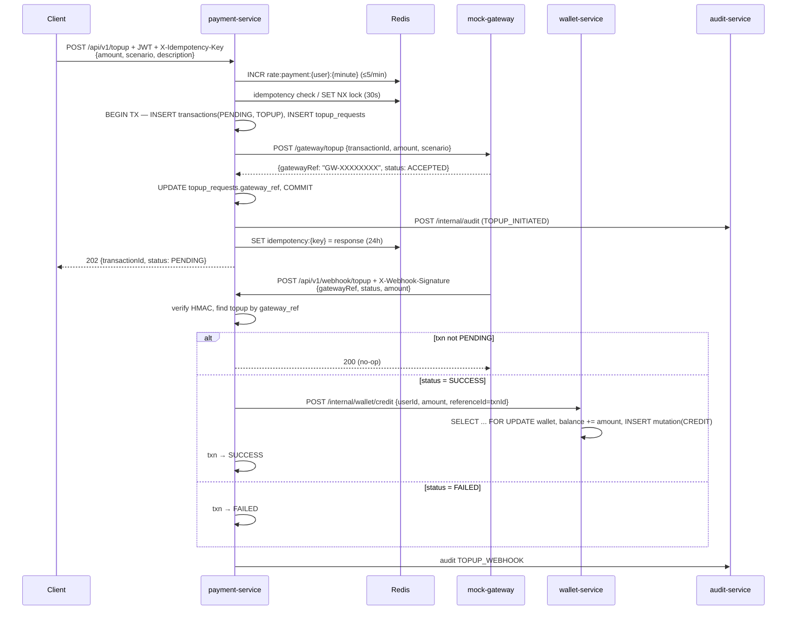
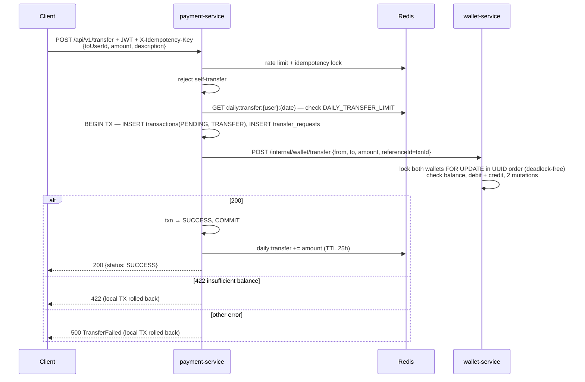
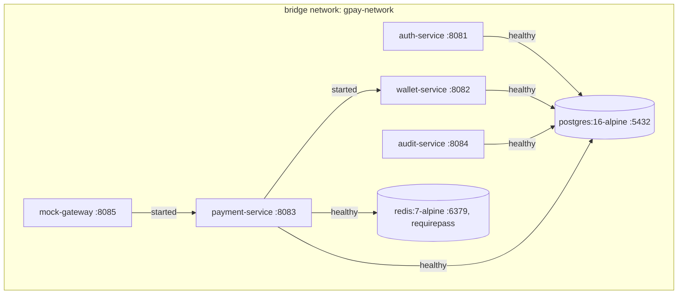

# Architecture — GPay Wallet

Microservices wallet system: register/login, top-up via a (mock) payment gateway, P2P transfer, balance and mutation history, audit logging.

> Source of truth: the code, including the auth/DB hardening patch. Where the code differs from the README's intent, this doc follows the code and flags the gap in [Known gaps](#9-known-gaps-from-code-trace).

---

## 1. Tech stack

| Layer | Choice |
|---|---|
| Language / runtime | Java 21 (Eclipse Temurin) |
| Framework | Spring Boot 3.5.14 (Web MVC, Data JPA, Security, Validation) |
| Build | Maven multi-module (`wallet-parent` → 5 modules) |
| Auth tokens | JJWT 0.12.5, HMAC-SHA (shared `JWT_SECRET`) |
| Database | PostgreSQL 16 — one instance, one schema per service |
| Cache / locks | Redis 7 (payment-service only) |
| Inter-service calls | Synchronous REST via `RestTemplate` |
| Packaging | Multi-stage Dockerfile per service, `docker-compose.yaml` |

---

## 2. Modules

```
monorepo-wallet/
├── pom.xml              # parent POM: Boot parent, Java 21, jjwt versions
├── auth/                # auth-service       :8081
├── wallets/             # wallet-service     :8082
├── payment/             # payment-service    :8083
├── auditlog/            # audit-service      :8084
├── paymentgateway/      # mock-gateway       :8085
├── db/migration/        # raw SQL, mounted into postgres initdb
└── docker-compose.yaml
```

Every service follows the same layered package layout under `com.gpay.<module>`:

```
controller → service (interface) → service/Impl → repository (Spring Data JPA) → entity
dto/        # Java records grouped in one *DTO class, incl. ApiResponse<T>
exception/  # nested RuntimeException types + @RestControllerAdvice
filter/     # TraceFilter (+ InternalApiKeyFilter where internal)
security/   # JwtAuthFilter (wallets, payment)
config/     # SecurityConfig, RestConfig, RedisConfig
```

All JSON responses use the envelope `{ "success": bool, "message": string, "data": T }`. Each service declares its own copy of `ApiResponse` (no shared library module).

---

## 3. System context



### Service responsibilities

| Service | Owns | Public API | Internal API | Calls out to |
|---|---|---|---|---|
| **auth** | `auth.users`, `auth.refresh_tokens` | `POST /api/v1/auth/{register,login,refresh,logout}` | — | — |
| **wallets** | `wallet.wallets`, `wallet.mutations` | `GET /v1/api/wallet/balance`, `GET /v1/api/wallet/api/v1/wallet/mutations` ⚠️ | `POST /api/v1/internal/wallet/{create,credit,debit,transfer}` | — |
| **payment** | `payment.transactions`, `payment.topup_requests`, `payment.transfer_requests`, Redis keys | `POST /api/v1/topup`, `POST /api/v1/transfer`, `GET /api/v1/transactions/{id}` | `POST /api/v1/webhook/topup` (HMAC) | wallets, auditlog, gateway |
| **auditlog** | `audit.audit_logs` | — | `POST /api/v1/internal/audit` | — |
| **paymentgateway** | stateless | — | `POST /gateway/topup` | payment (webhook) |

⚠️ Wallet paths are inconsistent (`/v1/api/...` prefix and a doubled mutations path) — see [Known gaps](#9-known-gaps-from-code-trace).

---

## 4. Security model

| Concern | Mechanism | Where |
|---|---|---|
| User authentication | Access JWT (`iss`=`JWT_ISSUER`, `jti`, `sub`=userId, `username`, `type=ACCESS`), TTL `JWT_ACCESS_EXPIRY_MINUTES` | Issued by [JwtService.java](auth/src/main/java/com/gpay/auth/service/common/JwtService.java) |
| Token validation | Each resource service verifies locally with the shared `JWT_SECRET` (no call to auth) and **requires** `iss` and `type=ACCESS` (30 s clock skew). Missing/invalid token → 401 via `HttpStatusEntryPoint` | [wallets JwtAuthFilter](wallets/src/main/java/com/gpay/wallets/security/JwtAuthFilter.java), [payment JwtAuthFilter](payment/src/main/java/com/gpay/payment/security/JwtAuthFilter.java) |
| Refresh tokens | Opaque 256-bit random value (not a JWT), stored as SHA-256 hash. Rotated with an atomic conditional `UPDATE`; reusing a rotated token revokes every session of the user; inactive users can't refresh | [AuthServiceImpl.java](auth/src/main/java/com/gpay/auth/service/Impl/AuthServiceImpl.java) |
| Login | Username/email normalized to lowercase. BCrypt always runs (dummy hash for unknown users) so timing doesn't reveal accounts; `is_active` checked only after a correct password; >72-byte passwords rejected before BCrypt | `AuthServiceImpl.login` |
| Passwords | BCrypt (8–72 chars, ≤72 UTF-8 bytes) | auth `SecurityConfig`, `AuthDTO` |
| Service-to-service | Static shared header `X-Internal-Api-Key` (`INTERNAL_API_KEY`) | `InternalApiKeyFilter` in wallets (only `/api/v1/internal/**`) and auditlog (all paths) |
| Gateway → webhook | `X-Webhook-Signature = hex(HMAC-SHA256("gatewayRef:status:amount", MOCK_GATEWAY_SECRET))` | [GatewayServiceImpl.java](paymentgateway/src/main/java/com/gpay/paymentgateway/service/Impl/GatewayServiceImpl.java) signs, [WebhookServiceImpl.java](payment/src/main/java/com/gpay/payment/service/Impl/WebhookServiceImpl.java) verifies |
| Ownership | `userId` always taken from the JWT `sub`, never from the request body; `GET /transactions/{id}` returns 404 if not owner | payment controllers |

All services are stateless (`SessionCreationPolicy.STATELESS`, CSRF disabled).

---

## 5. Core flows

### 5.1 Register / login / refresh

```mermaid
sequenceDiagram
    participant C as Client
    participant A as auth-service
    participant DB as auth schema

    C->>A: POST /register {username,email,password}
    A->>A: lowercase username/email, reject >72-byte password
    A->>DB: exists? → INSERT users (bcrypt); unique race → 409
    A-->>C: 201 {userId,username,email}

    C->>A: POST /login
    A->>DB: SELECT user by lowercase username
    A->>A: bcrypt match (dummy hash if user missing), then check is_active
    A->>DB: INSERT refresh_tokens (sha256(opaque token), expires_at=+JWT_REFRESH_EXPIRY_DAYS)
    A-->>C: {accessToken, refreshToken, userId, accessExpiresIn, "Bearer"}

    C->>A: POST /refresh {refreshToken}
    A->>DB: UPDATE … SET revoked=true WHERE hash=? AND NOT revoked AND not expired
    alt rowcount = 1 and user active
        A->>DB: INSERT new refresh token
        A-->>C: new token pair
    else token already revoked (reuse)
        A->>DB: revoke ALL tokens of user
        A-->>C: 401
    else expired / unknown / inactive user
        A-->>C: 401
    end
```

Note: registration does **not** create a wallet. A wallet row is created lazily the first time the user calls `GET balance` / `GET mutations` (`WalletServiceImpl.findWalletByUserId`, `INSERT … ON CONFLICT DO NOTHING`).

### 5.2 Top-up (async via gateway webhook)



Gateway scenarios (chosen by the client, for testing): `SUCCESS` (webhook after 1.5s), `FAILED` (after 1s), `TIMEOUT` (no webhook — txn stays `PENDING` until expired by `PendingTransactionScheduler`).

Validation: amount 10,000 – 50,000,000.

> ⚠️ As written, the gateway sends the webhook **synchronously, before** responding to payment-service, so the webhook arrives before `gateway_ref` is saved/committed. See [Known gaps](#9-known-gaps-from-code-trace) #1.

### 5.3 Transfer (synchronous)



Validation: amount ≥ 1,000. Daily limit default 10,000,000.

---

## 6. Cross-cutting concerns

### Consistency & concurrency

| Problem | Solution in code | Location |
|---|---|---|
| Concurrent balance updates | Pessimistic lock `SELECT … FOR UPDATE` (`@Lock(PESSIMISTIC_WRITE)`) + `@Version` column on wallets | [WalletRepository.java](wallets/src/main/java/com/gpay/wallets/repository/WalletRepository.java) |
| Deadlock on A→B / B→A transfers | Lock wallets in ascending `userId` order | `WalletServiceImpl.atomicTransfer` |
| Debit + credit atomicity | Single wallet-service DB transaction for both legs | `/internal/wallet/transfer` |
| Duplicate client requests | Redis idempotency per user (`X-Idempotency-Key`, SET NX lock + cached response) + DB `UNIQUE(user_id, idempotency_key)` | [IdempotencyServiceImpl.java](payment/src/main/java/com/gpay/payment/service/Impl/IdempotencyServiceImpl.java) |
| Duplicate webhook / credit / transfer | Skip if txn not `PENDING`; wallet credit/debit/transfer check `(wallet, reference_id, type)` under the row lock; DB `UNIQUE (wallet_id, reference_id, type)` as backstop | `WebhookServiceImpl`, `WalletServiceImpl` |
| Ledger corruption | DB `CHECK`s: `amount > 0`, `balance_after = balance_before ± amount`, enum values | [V1__0710261200_hardening_constraints.sql](db/migration/V1__0710261200_hardening_constraints.sql) |
| Abuse | 5 payment requests/min/user (fixed window, shared by topup + transfer); daily transfer cap | [RateLimitServiceImpl.java](payment/src/main/java/com/gpay/payment/service/Impl/RateLimitServiceImpl.java) |
| Stale top-ups | `@Scheduled(fixedDelay=5m)` marks `PENDING` TOPUP older than `PENDING_EXPIRE_MINUTES` as `EXPIRED` | [PendingTransactionScheduler.java](payment/src/main/java/com/gpay/payment/scheduler/PendingTransactionScheduler.java) |

There is no distributed transaction / saga. payment-service holds its local DB transaction open while calling wallet-service; if the remote call succeeds but the local commit fails, money moves without a payment record (rare, not reconciled).

### Idempotency request handling (payment controllers)

```
exists(lock or response)?
 ├─ response cached → 200 + cached body
 └─ lock only       → 409 "still being processed"
tryLock (SET NX idempotency:lock:{userId}:{key} PROCESSING EX 30)
 └─ fail → 409
execute → saveResponse (24h) → lock value = DONE (24h)
```

If the service throws, the lock is not released; retries get 409 for up to 30 s, then are processed again.

### Observability

- `TraceFilter` (every service): reads `X-Trace-Id` or generates a UUID, puts it in SLF4J MDC, echoes it in the response header.
- payment-service propagates `X-Trace-Id` on outbound calls to wallets, auditlog and gateway; `trace_id` is also persisted on `payment.transactions` and `audit.audit_logs`.
- Log pattern: `[traceId=…] [userId=…]` (userId set by `JwtAuthFilter` / login).
- Audit: payment-service posts `TOPUP_INITIATED`, `TOPUP_WEBHOOK`, `TRANSFER` events to audit-service. Failures are caught and logged, never fail the business call.
- No actuator dependency, metrics, or distributed tracing backend.

### Error mapping

| Exception | HTTP |
|---|---|
| Validation (`@Valid`) | 400 |
| Invalid credentials / token, bad webhook signature | 401 |
| Inactive account, missing internal API key | 403 |
| Not found (wallet, transaction) | 404 |
| Username/email/wallet exists, idempotency in-flight | 409 |
| Insufficient balance, daily limit | 422 |
| Rate limit | 429 + `Retry-After: 60` |
| Unhandled | 500 `"Internal server error"` |

---

## 7. Deployment (docker-compose)



- Each image: `maven:3.9.9-eclipse-temurin-21-alpine` build stage running `mvn package -pl <module> -am`, then `eclipse-temurin:21-jre-alpine` runtime as non-root `appuser`.
- Build context is the repo root (needed for the parent POM).
- Every container port is published to the host, including internal ones (8084, 8085, wallet `/internal`).
- DB schema is created by mounting `db/migration/` into `/docker-entrypoint-initdb.d` (runs only on an empty volume). Services use `ddl-auto: validate`.

### Configuration (env vars)

| Variable | Used by | Default |
|---|---|---|
| `DB_HOST`, `DB_PORT`, `DB_NAME`, `DB_USER`, `DB_PASSWORD` | compose → all DB services | — |
| `REDIS_PASSWORD` | redis, payment | — |
| `JWT_SECRET` | auth, wallets, payment | — (must be ≥ 256-bit for HS256) |
| `JWT_ISSUER` | auth (sets `iss`), wallets, payment (require it) | `gpay-auth` — must match across services |
| `JWT_ACCESS_EXPIRY_MINUTES`, `JWT_REFRESH_EXPIRY_DAYS` | auth | — |
| `INTERNAL_API_KEY` | wallets, payment, auditlog | auditlog has a hardcoded fallback |
| `MOCK_GATEWAY_SECRET` | payment, gateway | — |
| `DAILY_TRANSFER_LIMIT` | payment | 10000000 |
| `PAYMENT_RATE_LIMIT_PER_MINUTE` | payment | 5 |
| `TOPUP_TIMEOUT_SECONDS` | payment (gateway read timeout) | 5 |
| `PENDING_EXPIRE_MINUTES` | payment | 60 |
| `WALLET_SERVICE_URL`, `AUDIT_SERVICE_URL`, `PAYMENT_GATEWAY_URL` | payment | `http://localhost:808x` |
| `PAYMENT_SERVICE_WEBHOOK_URL` | gateway | `http://payment-service:8083/api/v1/webhook/topup` |

`.env.example` currently lists only a subset of these (it still uses `POSTGRES_DB_*` names that compose doesn't read).

### HTTP client timeouts (payment-service)

| Client | Connect | Read |
|---|---|---|
| Default `RestTemplate` (wallets, auditlog) | 3 s | 10 s |
| `gatewayRestTemplate` | 3 s | `TOPUP_TIMEOUT_SECONDS` (5 s) |

---

## 8. Key design decisions & trade-offs

| Decision | Why | Trade-off |
|---|---|---|
| Schema-per-service in one Postgres | Data ownership boundaries, simple local ops | Shared instance/user = no real isolation; single point of failure |
| Local JWT verification with shared secret | No auth round-trip per request | Secret on every service; no immediate access-token revocation |
| Pessimistic locking on wallets | Correctness over throughput for money | Hot wallets serialize; scale needs sharding/queueing |
| Redis SET NX idempotency (per user) + DB unique | Atomic, avoids GET-then-SET race; DB is the durable backstop | TTL tuning; lock not released on failure (30 s 409 window) |
| Money invariants as DB constraints | Code bugs can't write a corrupt ledger or double-credit | Violations surface as 500s; needs migration discipline |
| Sync REST between services | Simple | Temporal coupling; no retry/circuit breaker |
| Best-effort audit | Audit must not break payments | Lost events if audit is down (no queue/outbox) |
| HMAC-signed webhooks | Reject forged callbacks | Shared secret rotation is manual |

---

## 9. Known gaps (from code trace)

Originally found by static reading. Items marked ✅ were fixed in the hardening patch and verified with a runtime smoke test (Postgres + Redis + auth/wallets/payment/auditlog).

### Open

| # | Issue | Effect | Location |
|---|---|---|---|
| 1 | Gateway webhook is sent synchronously before `/gateway/topup` returns (`sendWebhookAsync` is a self-call, and `@EnableAsync` is absent). payment-service hasn't stored `gateway_ref` or committed yet | Webhook fails with "Unknown gatewayRef" (400); top-ups never credit, stay `PENDING` | `GatewayServiceImpl.initiateTopup`, `TopupServiceImpl.topup` |
| 2 | No `@EnableScheduling` in any module | `PendingTransactionScheduler` never runs; nothing expires; no refresh-token cleanup | `PaymentApplication`, `AuthApplication` |
| 3 | No `@EnableAsync` | `AuditClient.log` runs synchronously and adds audit latency to every payment request (contradicts README "fire-and-forget") | `PaymentApplication`, `AuditClient` |
| 5 | Wallet never created on register; credit/transfer require an existing wallet | Top-up credit / incoming transfer for a user who never called `GET balance` → 404 from wallet-service | `AuthServiceImpl.register`, `WalletClient.createWallet` (unused) |
| 6 | Transfer catch blocks set `FAILED` then rethrow inside `@Transactional` | Whole TX rolls back; failed transfers leave no `transactions` row; idempotency lock held 30 s | `TransferServiceImpl.transfer` |
| 8 | Wallet controller paths: `/v1/api/wallet/balance` and `/v1/api/wallet/api/v1/wallet/mutations` | Inconsistent with `/api/v1/...` used everywhere else | `WalletController.java` |
| 9 | Daily limit is read-check then later write (non-atomic); rate limit is a fixed window | Concurrent transfers can exceed the daily cap | `RateLimitServiceImpl` |
| 11 | Webhook signature compared with `String.equals` and expected value logged | Timing side-channel; secret-derived value in logs | `WebhookServiceImpl.validateSignature` |
| 12 | `wallets`, `payment`, `auditlog` POMs depend on the `auth` module (apparently for transitive jjwt) | Unneeded coupling to another service's code | module `pom.xml`s |
| 15 | Shared symmetric `JWT_SECRET` on every service | Any service can mint tokens; should move to EdDSA/RS256 + JWKS | all JWT users |
| 16 | No login brute-force protection | Unlimited password guessing | auth-service |

### Fixed

| # | Issue | Fix |
|---|---|---|
| 4 ✅ | `jsonb` audit columns mapped as plain `String` → inserts rejected | `@JdbcTypeCode(SqlTypes.JSON)`; unserializable payload stored as `NULL` |
| 7 ✅ | Resource services accepted any valid JWT incl. `type=REFRESH` | Parser requires `iss` + `type=ACCESS`; refresh tokens are now opaque, not JWTs |
| 10 ✅ | Refresh expiry hardcoded to 7 days | Uses `JWT_REFRESH_EXPIRY_DAYS` |
| 13 ✅ | Double-escaped username regex | `^(?!\d+$)[a-zA-Z0-9]+$` |
| 14 ✅ | Transfer without `description` → `Map.of` NPE in `WalletClient` → every such transfer failed | Pass the defaulted `txn.getDescription()` |
| A2–A5 ✅ | Refresh: no active-user check, read-check-write race, no reuse detection; login leaked existence/status via timing/order | Atomic `consumeIfActive`, family revocation on reuse, dummy-hash BCrypt, status check after password |
| A8–A10 ✅ | Register race → 500; >72-byte password → 500; case-sensitive identity | 409 handler, byte-length guard, lowercase normalization + `lower()` unique indexes |
| A12 ✅ | Invalid/missing token → 403; JWT filter registered twice | `HttpStatusEntryPoint(401)`; servlet registration disabled |
| E2/E3 ✅ | Lazy wallet create race aborted TX; `version = 0L` forced `merge()` | `INSERT … ON CONFLICT DO NOTHING`; `version` null on new entities |
| D1–D9 ✅ | Missing DB money invariants, global idempotency key, index mismatch | See [database.md §7](database.md#7-hardening-status) |

See [database.md](database.md) for schema details.
