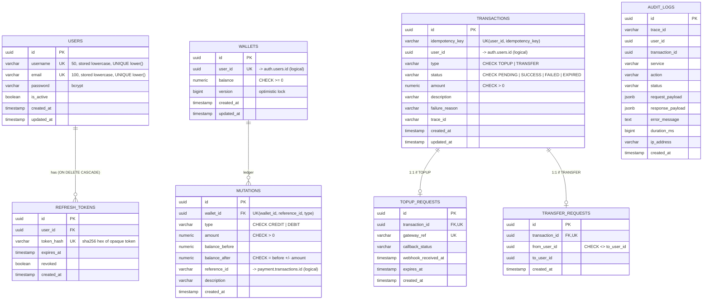
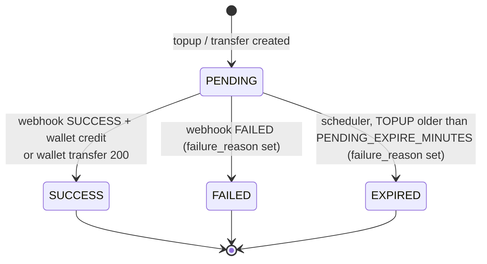

# Database — GPay Wallet

Persistence layer: one PostgreSQL 16 instance split into **4 schemas** (one per service), plus **Redis** for payment-service locks and counters.

> Source of truth: [db/migration/](db/migration/) (including the hardening migration [V1__0710261200_hardening_constraints.sql](db/migration/V1__0710261200_hardening_constraints.sql)) and the JPA entities. For service context see [architecture.md](architecture.md).

---

## 1. Layout

| Schema | Owner service | Tables | JDBC `currentSchema` |
|---|---|---|---|
| `auth` | auth-service | `users`, `refresh_tokens` | `auth` |
| `wallet` | wallet-service | `wallets`, `mutations` | `wallet` |
| `payment` | payment-service | `transactions`, `topup_requests`, `transfer_requests` | `payment` |
| `audit` | audit-service | `audit_logs` | `audit` |

Rules:

- A service reads/writes **only its own schema**. Cross-service data is fetched via REST, never via SQL joins.
- Cross-schema relations are **logical only** (UUIDs, no foreign keys). Physical FKs exist only inside a schema.
- All services connect with the same DB user (`DB_USER`), so the separation is by convention, not by privileges.
- PKs: `UUID DEFAULT gen_random_uuid()` (DB) / `GenerationType.UUID` (JPA).
- Money: `NUMERIC(19,2)` ↔ `BigDecimal`. All amount columns have `CHECK (amount > 0)`.
- Timestamps: `TIMESTAMP` (no time zone), filled from the JVM clock (`LocalDateTime.now()`, `@CreationTimestamp`, `@UpdateTimestamp`). Containers run UTC by default.
- Enums are stored as `VARCHAR` (`@Enumerated(EnumType.STRING)`) and guarded by `CHECK (col IN (...))`.
- **Money invariants live in the database**, not only in Java: non-negative balance, ledger maths, one ledger entry per wallet/reference/type, one transaction per user/idempotency key.

---

## 2. Entity-relationship diagram



### Logical (cross-schema) references

```
auth.users.id ─┬─< wallet.wallets.user_id              (1:1, unique)
               ├─< payment.transactions.user_id
               ├─< payment.transfer_requests.from_user_id / to_user_id
               └─< audit.audit_logs.user_id

payment.transactions.id ─┬─< wallet.mutations.reference_id   (as VARCHAR; 1 CREDIT for topup, DEBIT + CREDIT for transfer)
                         └─< audit.audit_logs.transaction_id

payment.transactions.trace_id  ≈  audit.audit_logs.trace_id   (X-Trace-Id correlation)
```

None of these are enforced; orphans are possible (e.g. a user deleted in `auth` keeps their wallet).

---

## 3. Tables

### 3.1 `auth.users`

Migration: [V1__0506260839_init_table_users.sql](db/migration/V1__0506260839_init_table_users.sql) · Entity: [Users.java](auth/src/main/java/com/gpay/auth/entity/Users.java)

| Column | Type | Null | Default | Notes |
|---|---|---|---|---|
| `id` | UUID | N | `gen_random_uuid()` | PK. Used as JWT `sub` and as `user_id` across all services |
| `username` | VARCHAR(50) | N | | Stored lowercase; login identifier |
| `email` | VARCHAR(100) | N | | Stored lowercase |
| `password` | VARCHAR(255) | N | | BCrypt hash. Input limited to 72 UTF-8 bytes (BCrypt limit) |
| `is_active` | BOOLEAN | N | `TRUE` | `false` → login 403 (only after a correct password), refresh rejected and all sessions revoked |
| `created_at` / `updated_at` | TIMESTAMP | N | `NOW()` | |

Constraints / indexes: `UNIQUE(username)`, `UNIQUE(email)`, `uq_users_username_lower`, `uq_users_email_lower` (unique on `lower()`; case-variant duplicates are rejected by the DB even if a caller skips normalization).

Concurrent register with the same identity: the loser hits the unique index at commit → `DataIntegrityViolationException` → HTTP 409.

### 3.2 `auth.refresh_tokens`

Migration: [V1__0506260841__init_table_refresh_token.sql](db/migration/V1__0506260841__init_table_refresh_token.sql) · Entity: [RefreshToken.java](auth/src/main/java/com/gpay/auth/entity/RefreshToken.java)

| Column | Type | Null | Default | Notes |
|---|---|---|---|---|
| `id` | UUID | N | `gen_random_uuid()` | PK |
| `user_id` | UUID | N | | FK → `auth.users(id)` ON DELETE CASCADE |
| `token_hash` | VARCHAR(255) | N | | UNIQUE; SHA-256 hex of the raw token. Raw token never stored |
| `expires_at` | TIMESTAMP | N | | now + `JWT_REFRESH_EXPIRY_DAYS` |
| `revoked` | BOOLEAN | N | `FALSE` | Set on rotation, logout, reuse detection, inactive user |
| `created_at` | TIMESTAMP | N | `NOW()` | |

Indexes: `idx_refresh_tokens_user_id` (revoke-all), `idx_refresh_tokens_expires_at` (cleanup).

Token format: opaque 256-bit random value (base64url, 43 chars). It is not a JWT: it is validated only by hash lookup, so it cannot be presented to resource services as an access token. Tokens issued before this change (JWT format) still work until they expire, because lookup is by hash.

Rotation protocol ([AuthServiceImpl.refreshToken](auth/src/main/java/com/gpay/auth/service/Impl/AuthServiceImpl.java)):

```sql
-- consumeIfActive: atomic compare-and-set; of N concurrent refreshes exactly one gets rowcount 1
UPDATE auth.refresh_tokens SET revoked = true
WHERE token_hash = ? AND revoked = false AND expires_at > now();
```

| rowcount | Token state | Action |
|---|---|---|
| 1 | active | Issue new pair (unless user inactive → revoke all, 401) |
| 0 | already revoked | **Reuse detected** → revoke every token of the user (committed via `noRollbackFor`), 401 |
| 0 | expired | 401 |

Lifecycle: rows are not deleted yet. `RefreshTokenRepository.deleteExpiredAndRevoked` exists but no job calls it (needs `@EnableScheduling` + a scheduled job).

### 3.3 `wallet.wallets`

Migration: [V1__0606261108_init_table_wallets.sql](db/migration/V1__0606261108_init_table_wallets.sql) · Entity: [Wallets.java](wallets/src/main/java/com/gpay/wallets/entity/Wallets.java)

| Column | Type | Null | Default | Notes |
|---|---|---|---|---|
| `id` | UUID | N | `gen_random_uuid()` | PK |
| `user_id` | UUID | N | | UNIQUE — exactly one wallet per user |
| `balance` | NUMERIC(19,2) | N | `0.00` | `CHECK (balance >= 0)` — last line of defence against overdraft |
| `version` | BIGINT | N | `0` | JPA `@Version`. Left `null` on new entities so Spring Data uses `persist()`, not `merge()` |
| `created_at` / `updated_at` | TIMESTAMP | N | `NOW()` | `@CreationTimestamp` / `@UpdateTimestamp` |

Access patterns:
- Read: `findByUserId` (balance, mutations).
- Write: `findByUserIdForUpdate` → `SELECT … WHERE user_id = ? FOR UPDATE` before every credit/debit/transfer. Transfers lock two rows in ascending `user_id` order.
- Lazy creation on first `GET balance` / `GET mutations`:
  ```sql
  INSERT INTO wallet.wallets (user_id) VALUES (?) ON CONFLICT (user_id) DO NOTHING;
  ```
  Concurrent first accesses are a no-op instead of a unique violation (which in Postgres would abort the whole transaction).

### 3.4 `wallet.mutations`

Migration: [V1__0606261109_init_table_mutations.sql](db/migration/V1__0606261109_init_table_mutations.sql) · Entity: [Mutations.java](wallets/src/main/java/com/gpay/wallets/entity/Mutations.java)

Append-only balance ledger.

| Column | Type | Null | Notes |
|---|---|---|---|
| `id` | UUID | N | PK |
| `wallet_id` | UUID | N | FK → `wallet.wallets(id)` |
| `type` | VARCHAR(20) | N | `CHECK IN ('CREDIT','DEBIT')` |
| `amount` | NUMERIC(19,2) | N | `CHECK (amount > 0)` |
| `balance_before` / `balance_after` | NUMERIC(19,2) | N | `chk_mutations_balance_math`: CREDIT ⇒ after = before + amount, DEBIT ⇒ after = before − amount |
| `reference_id` | VARCHAR(100) | Y | `payment.transactions.id` as text. Top-up → 1 row, transfer → 2 rows (DEBIT on sender, CREDIT on receiver) |
| `description` | VARCHAR(255) | Y | Transfer rows prefixed `Transfer out:` / `Transfer in:` |
| `created_at` | TIMESTAMP | N | |

Constraints / indexes:
- `uq_mutations_wallet_ref_type UNIQUE (wallet_id, reference_id, type)`: DB-level idempotency. `NULL` references are not deduplicated.
- `idx_mutations_wallet_created (wallet_id, created_at DESC)`: matches `findByWalletIdOrderByCreatedAtDesc`.
- `idx_mutations_reference_id`: reconciliation lookups by payment transaction.

Idempotency in code: `credit`, `debit` and `atomicTransfer` first lock the wallet row(s), then check `existsByWalletIdAndReferenceIdAndType`. Duplicates are skipped and return the current balance. Because the check runs under the row lock, concurrent duplicates are serialized; the unique constraint is the backstop.

### 3.5 `payment.transactions`

Migration: [V1__0606262000_init_table_transactions.sql](db/migration/V1__0606262000_init_table_transactions.sql) · Entity: [Transactions.java](payment/src/main/java/com/gpay/payment/entity/Transactions.java)

| Column | Type | Null | Default | Notes |
|---|---|---|---|---|
| `id` | UUID | N | `gen_random_uuid()` | PK; returned to client as `transactionId` |
| `idempotency_key` | VARCHAR(100) | N | | From `X-Idempotency-Key`. Unique **per user** |
| `user_id` | UUID | N | | Initiator (top-up owner / transfer sender) |
| `type` | VARCHAR(15) | N | | `CHECK IN ('TOPUP','TRANSFER')` |
| `status` | VARCHAR(15) | N | `'PENDING'` | `CHECK IN ('PENDING','SUCCESS','FAILED','EXPIRED')` |
| `amount` | NUMERIC(19,2) | N | | `CHECK (amount > 0)` |
| `description` | VARCHAR(255) | Y | | Defaulted in code (`Top up via payment gateway` / `Transfer`) |
| `failure_reason` | VARCHAR(255) | Y | | Why FAILED/EXPIRED, e.g. `Gateway reported status FAILED`, `No gateway callback within 60 minutes` |
| `trace_id` | VARCHAR(100) | Y | | Request trace id |
| `created_at` / `updated_at` | TIMESTAMP | N | `NOW()` | |

Constraints / indexes:
- `uq_transactions_user_idem UNIQUE (user_id, idempotency_key)`: two users can use the same key; one user cannot reuse a key.
- `idx_transactions_user_created (user_id, created_at DESC)`: user history.
- `idx_transactions_created_at (created_at DESC)`.
- `idx_transactions_pending_topup (created_at) WHERE status='PENDING' AND type='TOPUP'`: partial index for the expiry scheduler; stays small because terminal rows drop out.

Status state machine:



Terminal states are final: webhooks for a non-`PENDING` transaction are ignored. A failed transfer is still rolled back entirely (no row), so `FAILED` currently only occurs for top-ups (see [architecture.md §9](architecture.md#9-known-gaps-from-code-trace)).

### 3.6 `payment.topup_requests`

Migration: [V1__0606262001_init_table_topup_request.sql](db/migration/V1__0606262001_init_table_topup_request.sql) · Entity: [TopupRequest.java](payment/src/main/java/com/gpay/payment/entity/TopupRequest.java)

| Column | Type | Null | Notes |
|---|---|---|---|
| `id` | UUID | N | PK |
| `transaction_id` | UUID | N | UNIQUE, FK → `payment.transactions(id)` (1:1) |
| `gateway_ref` | VARCHAR(100) | Y | `GW-XXXXXXXX` from gateway; webhook lookup key. `uq_topup_requests_gateway_ref` (NULLs allowed while the gateway hasn't answered) |
| `callback_status` | VARCHAR(50) | Y | Raw webhook status |
| `webhook_received_at` | TIMESTAMP | Y | |
| `expires_at` | TIMESTAMP | N | now + `PENDING_EXPIRE_MINUTES`. Not used by the scheduler (it uses `transactions.created_at`) |
| `created_at` | TIMESTAMP | N | |

Indexes: `idx_topup_requests_expires_at`.

### 3.7 `payment.transfer_requests`

Migration: [V1__0606262002_init_table_transfer_request.sql](db/migration/V1__0606262002_init_table_transfer_request.sql) · Entity: [TransferRequest.java](payment/src/main/java/com/gpay/payment/entity/TransferRequest.java)

| Column | Type | Null | Notes |
|---|---|---|---|
| `id` | UUID | N | PK |
| `transaction_id` | UUID | N | UNIQUE, FK → `payment.transactions(id)` (1:1) |
| `from_user_id` | UUID | N | Same as `transactions.user_id`. `CHECK (from_user_id <> to_user_id)` |
| `to_user_id` | UUID | N | Recipient |
| `created_at` | TIMESTAMP | N | |

Indexes: `idx_transfer_requests_from_user_id`, `idx_transfer_requests_to_user_id`.

### 3.8 `audit.audit_logs`

Migration: [V1__0706261301_init_table_audit_log.sql](db/migration/V1__0706261301_init_table_audit_log.sql) · Entity: [AuditLog.java](auditlog/src/main/java/com/gpay/auditlog/entity/AuditLog.java)

Append-only event log written via `POST /api/v1/internal/audit`.

| Column | Type | Null | Notes |
|---|---|---|---|
| `id` | UUID | N | PK |
| `trace_id` | VARCHAR(100) | Y | Correlates with service logs and `payment.transactions.trace_id` |
| `user_id` | UUID | Y | |
| `transaction_id` | UUID | Y | |
| `service` | VARCHAR(50) | N | e.g. `payment-service` |
| `action` | VARCHAR(100) | N | `TOPUP_INITIATED`, `TOPUP_WEBHOOK`, `TRANSFER` |
| `status` | VARCHAR(50) | Y | Transaction status at event time |
| `request_payload` / `response_payload` | JSONB | Y | Mapped as `String` with `@JdbcTypeCode(SqlTypes.JSON)`, so it binds as `jsonb`. Payloads Jackson can't serialize are stored as `NULL` with a warning (`toString()` would not be valid JSON) |
| `error_message` | TEXT | Y | |
| `duration_ms` | BIGINT | Y | |
| `ip_address` | VARCHAR(45) | Y | IPv6-sized. Currently always null (callers pass `null`) |
| `created_at` | TIMESTAMP | N | |

Indexes: `idx_audit_logs_trace_id`, `idx_audit_logs_user_id`, `idx_audit_logs_transaction_id`, `idx_audit_logs_created_at DESC`.

No retention/partitioning; grows unbounded.

---

## 4. Redis keyspace (payment-service)

Client: `StringRedisTemplate`, all values are strings.

| Key pattern | Value | TTL | Written by | Purpose |
|---|---|---|---|---|
| `idempotency:lock:{userId}:{idempotencyKey}` | `PROCESSING` → `DONE` | 30 s → 24 h | `IdempotencyServiceImpl.tryLock` (`SET NX EX`) / `saveResponse` | In-flight guard for duplicate requests |
| `idempotency:{userId}:{idempotencyKey}` | JSON `TransactionResponse` | 24 h | `saveResponse` | Replayed to duplicate requests |
| `rate:payment:{userId}:{epochMinute}` | counter | 60 s (set on first `INCR`) | `RateLimitServiceImpl.checkAndIncrementRateLimit` | Max `PAYMENT_RATE_LIMIT_PER_MINUTE` (5) topup+transfer calls per minute |
| `daily:transfer:{userId}:{yyyy-MM-dd}` | decimal string (sum of successful transfers) | 25 h | `incrementDailyTransfer` (GET + SET) | `DAILY_TRANSFER_LIMIT` enforcement |

Notes:
- Idempotency keys are scoped by user, the same as the DB's `UNIQUE (user_id, idempotency_key)`.
- Daily-limit check and increment are separate non-atomic operations; `INCRBYFLOAT` or a Lua script would make it atomic.
- Redis data is persisted in the `redis_data` volume but treated as disposable; Postgres `uq_transactions_user_idem` is the durable backstop.

---

## 5. Transactions & locking

| Operation | Service | DB transaction scope | Locks |
|---|---|---|---|
| Register / login / logout | auth | One `@Transactional` per call | none |
| Refresh | auth | One TX; `noRollbackFor = InvalidTokenException` so reuse-revocation commits | row lock taken by the conditional `UPDATE` |
| Credit (top-up) | wallets | Lock wallet → duplicate check → update balance → insert mutation | `FOR UPDATE` on 1 wallet row |
| Debit | wallets | Same as credit, plus balance check | `FOR UPDATE` on 1 wallet row |
| Atomic transfer | wallets | One TX: duplicate check, both legs + 2 mutations | `FOR UPDATE` on 2 rows, ascending `user_id` order |
| Lazy wallet create | wallets | `INSERT … ON CONFLICT DO NOTHING` then read | none |
| Top-up initiate | payment | TX open across the gateway HTTP call | none |
| Webhook | payment | TX open across the wallet credit HTTP call | none |
| Transfer | payment | TX open across the wallet transfer HTTP call; any exception → full rollback | none |
| Expire stale | payment | One TX per scheduler run (scheduler currently not enabled) | none |

Holding a local transaction (and a Hikari connection) across a remote HTTP call ties DB pool usage to downstream latency: up to 10 s per call with the default read timeout, pool size 20.

---

## 6. Migrations

- Files live in [db/migration/](db/migration/) and are mounted into the postgres container at `/docker-entrypoint-initdb.d`.
- Postgres runs them **once**, in filename order, only when the `postgres_data` volume is empty. Changes to existing files or new files are **not** applied to an existing volume.
- No migration tool (Flyway/Liquibase) is on the classpath. The names look like Flyway (`V1__<ddMMyyHHmm>_…`), but every file uses version `V1`, so Flyway would reject them as duplicates.
- Services run `spring.jpa.hibernate.ddl-auto: validate`; startup fails if entities and tables drift.

Execution order:

```
V1__0506260838_init_schema_auth.sql
V1__0506260839_init_table_users.sql
V1__0506260841__init_table_refresh_token.sql
V1__0606261105_init_schema_wallet.sql
V1__0606261108_init_table_wallets.sql
V1__0606261109_init_table_mutations.sql
V1__0606261959_init_schema_payment.sql
V1__0606262000_init_table_transactions.sql
V1__0606262001_init_table_topup_request.sql
V1__0606262002_init_table_transfer_request.sql
V1__0706261300_init_schema_audit.sql
V1__0706261301_init_table_audit_log.sql
V1__0710261200_hardening_constraints.sql      # constraints, per-user idempotency, index cleanup, failure_reason
```

Applying the hardening migration:

```bash
# Fresh environment (destroys data): runs every file automatically
docker compose down -v && docker compose up --build

# Existing volume: apply the new file once, by hand
docker exec -i postgres psql -U "$DB_USER" -d "$DB_NAME" -v ON_ERROR_STOP=1 \
  < db/migration/V1__0710261200_hardening_constraints.sql
```

On an existing volume the migration first lowercases `auth.users.username/email`. It fails if case-variant duplicates already exist (e.g. `Alice` and `alice`), or if existing rows violate a new `CHECK`/`UNIQUE`. Resolve those rows first.

Deploy order: **migration first, then services.** The new `Transactions.failureReason` mapping fails `ddl-auto: validate` if the column is missing.

---

## 7. Hardening status

| Item | Status |
|---|---|
| Ledger `CHECK`s (amount > 0, balance maths, enum values) | ✅ `V1__0710261200` |
| DB-level ledger idempotency `UNIQUE (wallet_id, reference_id, type)` | ✅ + code checks under the row lock |
| Per-user idempotency `UNIQUE (user_id, idempotency_key)` | ✅ + Redis keys scoped by user |
| Case-insensitive unique username/email | ✅ `lower()` unique indexes + normalization in auth-service |
| `UNIQUE (gateway_ref)` | ✅ |
| Query-shaped indexes (mutation history, pending-topup partial, user history) | ✅ |
| Drop indexes duplicating UNIQUE constraints | ✅ |
| `failure_reason` on transactions | ✅ set by webhook (FAILED) and scheduler (EXPIRED) |
| `jsonb` audit payload mapping | ✅ `@JdbcTypeCode(SqlTypes.JSON)` |
| Race-safe lazy wallet create | ✅ `INSERT … ON CONFLICT DO NOTHING` |
| `TransferRequest` explicit `schema = "payment"` | ✅ |
| Flyway with real versioning | ⏳ open: schema changes on existing volumes are still manual |
| Separate DB role per schema (`audit` INSERT-only) | ⏳ open |
| `TIMESTAMPTZ` + `Instant` | ⏳ open: must change DB and entities in one release (`validate`) |
| `mutations.reference_id` as `UUID` | ⏳ open |
| Refresh-token cleanup job, audit retention/partitioning | ⏳ open: needs `@EnableScheduling` |
| Persist FAILED transfers (currently rolled back) | ⏳ open: see architecture.md §9 |
